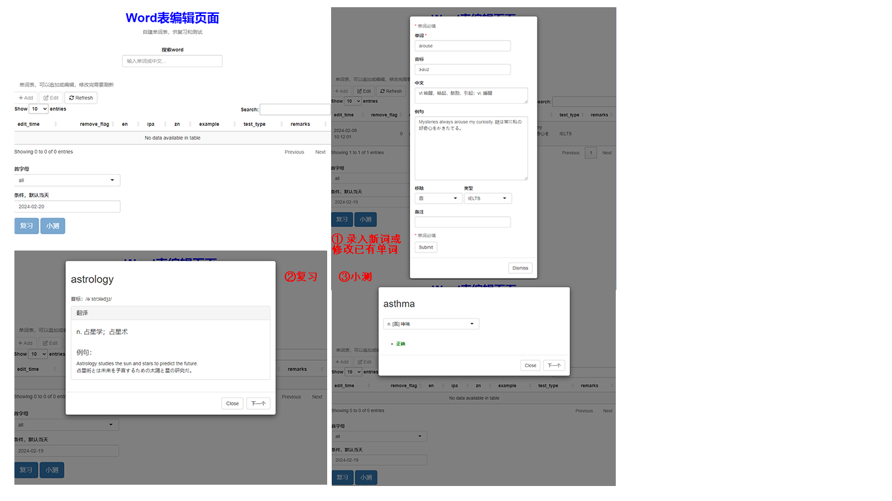

# word_list
This is a shiny app for recording, reviewing, and testing English vocabulary.

We can search for a word and edit its information using the `Edit` button, as the core IELTS vocabulary is pre-imported into the `data.sqlite`. If the word is not found, press the `Add` button and edit the details.

The `复习` (Review) button will randomly display a word selected based on the condition input, which can be an `首字母` (initial) or the remarks. By default, the remarks are today's timestamp, and the vocabulary for review and testing consists of the words we edited today.

The `小测` (Take a Quiz) button will randomly display a word, and we can select the meaning from the drop-down list. The app will then check the answer and show the result immediately.

### 中文说明

这是一个用shiny写的单词表应用，可以用来记录单词表，复习和测试。

`data.sqlite`里预先导入了雅思核心单词，可以在搜索框中输入单词，如果有查询结果，可以点击`Edit`按钮进行修改和增加例句等。如果没有查询到，可以点击 `Add` 按钮进行新增。

`复习`和`小测`按钮的单词表来自于上述的条件筛选，可以是首字母或者其他条件，即编辑弹窗中的备注。默认条件是当天的时间戳，即当天编辑过的所有单词。`复习`按钮会随机抽取一个词展示用于复习。`小测`按钮会提供下拉选项，并检查答案是否正确。

PS：记忆曲线和报表等功能等后续有空可以加，目前感觉没啥必要。词库也可以删掉写个脚本自己导入。



## Install

#### Build Image

```
docker build -t word_list .
```

#### Run Container

```
docker run -p yourport:3838 word_list:latest
```

It can be visited by `http://127.0.0.1/yourport`


#### OR Run Container By [ShinyProxy](https://www.shinyproxy.io/)

##### 1.  install java 8

```
yum install java-1.8.0-openjdk
```

##### 2.set the port of docker to `2375`

```
mkdir -p /etc/systemd/system/docker.service.d/
vi /etc/systemd/system/docker.service.d/override.conf

# input the following content
[Service]
ExecStart=
ExecStart=/usr/bin/dockerd -H unix:// -D -H tcp://127.0.0.1:2375

# restart docker 
systemctl daemon-reload
systemctl restart docker
```

##### 3. install shinyproxy

```
wget https://www.shinyproxy.io/downloads/shinyproxy_3.0.1_x86_64.rpm
rpm -i shinyproxy_3.0.1_x86_64.rpm
```

##### 4. copy application.yml，the template can be download from [github](https://github.com/openanalytics/shinyproxy-config-examples/blob/master/03-containerized-kubernetes/shinyproxy-example/application.yml).

```
cp application.yml /etc/shinyproxy/application.yml
```

##### 5. restart shinyproxy

```
systemctl status shinyproxy
systemctl enable shinyproxy
```

It can be visited by `http://127.0.0.1/yourport`
